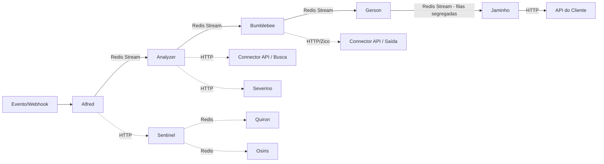

## Visão Geral da Arquitetura (Teoria)

> **Summary:** A Automação é uma arquitetura orientada a microsserviços (~16 serviços) dividida em bounded contexts (Engine, Management, Monitoramento, Adapters), comunicando-se por Redis Stream, SQS, HTTP e gRPC sobre AWS com Kubernetes.

A arquitetura foi projetada para trabalhar **assincronamente** e orientada a **microsserviços**. Está dividida em **4 contextos delimitados de negócio** (Bounded Contexts), e dentro de cada contexto por **responsabilidade única** (SRP), onde cada serviço é responsável por uma necessidade de negócio específica.

### Macro-Contextos

| Contexto | Domínios Internos | Responsabilidade |
|---|---|---|
| **Engine** | Discovery, Transformer, Delivery | Execução do pipeline de Automação |
| **Management** | Settings, Monitoring | APIs de configuração e monitoramento |
| **Monitoramento/Resiliência** | — | Ciclo de vida, circuit breaker, reprocessamento |
| **Adapters** | — | Exceções ao processo, tratamento específico por cliente |

---

## Stack Tecnológica (Teoria)

> **Summary:** A stack tecnológica da Automação combina Golang, Java e TypeScript para microsserviços, MongoDB como banco por serviço, Redis para streaming, cache e locks, sobre infraestrutura AWS com Kubernetes e CI/CD via Jenkins.

| Componente | Tecnologia |
|---|---|
| **Linguagens** | Golang, Java, TypeScript |
| **Banco de Dados** | MongoDB (cada serviço com seu banco próprio) |
| **Mensageria / Streaming** | Redis Stream (pipeline principal), SQS (fluxos específicos) |
| **Cache / Locks** | Redis |
| **Comunicação** | Redis Stream, SQS, HTTP, gRPC |
| **Templates** | Handlebars (motor de transformação no Bumblebee) |
| **Cloud** | AWS |
| **Orquestração** | Kubernetes |
| **CI/CD** | Jenkins (automatizado) |
| **Observabilidade** | Kibana (operações), Grafana (time técnico) |

---

## Serviços — Catálogo Completo (Teoria)

> **Summary:** Os 16 microsserviços da Automação estão organizados em 4 bounded contexts, cada um com linguagem, responsabilidade e origem do nome documentados, cobrindo pipeline core, monitoramento, gestão e processamento em lote.

### Contexto: Engine — Pipeline Core

| Serviço | Linguagem | Responsabilidade | Origem do Nome |
|---|---|---|---|
| **Alfred** | Java | Porta de entrada — captura eventos (via fila ou webhook), valida ações, inicia monitor de ciclo de vida | Mordomo do Batman |
| **Analyzer** | Java | Descobre os dados — analisa configurações e monta o "de" | Analisador de dados (contexto anterior) |
| **Bumblebee** | TypeScript | Transforma o dado — aplica template Handlebars (conector de saída) ao "de" | Personagem dos Transformers |
| **Gerson** | Golang | Distribui o dado — classifica como lenta, rápida ou circuit breaker e encaminha à fila destino | Camisa 10 da seleção brasileira de 1970 |
| **Jaminho** | Java | Entrega o dado — executa a chamada à API do cliente | Carteiro da série Chaves |

### Contexto: Engine — Validação e Agendamento

| Serviço | Linguagem | Responsabilidade | Origem do Nome |
|---|---|---|---|
| **Severino** | TypeScript | Valida se o dado ("DE") tem todas as informações necessárias para seguir no pipeline | Personagem da Zorra Total |
| **Pepper** | TypeScript | Agendamento de Automações — executa automações em momento futuro | Personagem do Homem de Ferro |

### Contexto: Engine — Processamento em Lote

| Serviço | Linguagem | Responsabilidade | Origem do Nome |
|---|---|---|---|
| **Chapa** | Golang | Descarrega a carga enviada pelo cliente e coloca em tópico para processamento | Ajudantes de descarregar caminhões |
| **BatchService** | Java | Envia cada operação do lote à API de destino | — |

### Contexto: Monitoramento e Resiliência

| Serviço | Linguagem | Responsabilidade | Origem do Nome |
|---|---|---|---|
| **Sentinel** | Java | Monitora tudo que passa pela Automação (ciclo de vida, tempo de resposta). Classifica APIs como lenta/rápida | Sentinelas da Matrix |
| **Quiron** | Golang | Controla o circuit breaker quando APIs dos clientes estão com problemas | Deus grego da medicina |
| **Osiris** | Golang | Reprocessa dados de acordo com as políticas de reprocessamento | Deus egípcio |

### Contexto: Management — Configuração e Gestão

| Serviço | Linguagem | Responsabilidade | Origem do Nome |
|---|---|---|---|
| **Automation Management** | Java | Gestão das automações (CRUD de configurações via API V2) | — |
| **Connector API** | TypeScript | Gestão dos conectores de saída | — |
| **Zico** | Java | Distribui informações dos conectores de saída entre serviços (Management e Bumblebee) | Zico, ícone do futebol brasileiro |
| **Custom-API** | TypeScript | API REST para clientes usarem Automações sem eventos | — |

---

## Fluxo de Comunicação (Teoria)

> **Summary:** O pipeline core da Automação se comunica sequencialmente via Redis Stream entre os microsserviços, com fluxos auxiliares por SQS, HTTP e gRPC para interações laterais entre serviços de monitoramento e configuração.



- **Pipeline principal:** Redis Stream (Alfred → Analyzer → Bumblebee → Gerson → Jaminho)
- **Fluxos laterais:** SQS, HTTP, gRPC
- **Monitoramento:** Sentinel lê de todos os tópicos do pipeline

---

## Decisões Arquiteturais (Teoria)

> **Summary:** As decisões arquiteturais da Automação incluem a escolha de Redis Stream por custo-benefício em detrimento do Kafka, e a organização em microsserviços por bounded contexts com responsabilidade única para isolamento de domínios de negócio.

### Redis Stream vs Kafka

- **Decisão:** Adotar Redis Stream
- **Motivo:** Custo. O Redis entregou exatamente o que era necessário, tornando o Kafka desnecessário para o caso de uso.

### Microsserviços por Bounded Context + SRP

- **Decisão:** Dividir a aplicação em ~16 serviços
- **Motivo:** Organização por contextos delimitados de negócio (Engine, Management, Monitoramento, Adapters) + responsabilidade única dentro de cada contexto.

### Banco por serviço

- **Decisão:** Cada serviço possui seu próprio MongoDB
- **Motivo:** Garantir independência entre serviços.

---

## Variáveis de Ambiente — Analyzer (Prática)

> **Summary:** As variáveis de ambiente do Analyzer revelam as dependências do serviço incluindo MongoDB, Redis, Redis Stream, Connector API, Sentinel API e Severino API.

### Variáveis de ambiente do Analyzer

```bash
AWS_ACCESS_KEY=xxx
AWS_REGION=us-east-1
AWS_SECRET_ACCESS_KEY=xxx
ANALYZER_MONGO_DATABASE=analyzer
ANALYZER_MONGO_HOST=dese-mongo.umov.me
ANALYZER_MONGO_PASSWORD=xxx
ANALYZER_MONGO_PORT=27017
ANALYZER_MONGO_USER=analyzer
PUSH_DEVID=9FA5C1856901215
REDIS_HOST=dese-redis.umov.me
REDIS_PORT=6379
REDIS_STREAM_HOST=dese-stream.umov.me
REDIS_STREAM_PORT=6379
HOST_CONNECTOR_API=https://dese-automation-connector-api.umov.me
HOST_SENTINEL_API=https://dese-sentinel-api.umov.me/monitor/start
HOST_SEVERINO_API=https://dese-severino-api.umov.me/validation
```

| Dependência | Host | Protocolo |
|---|---|---|
| MongoDB | `dese-mongo.umov.me:27017` | TCP |
| Redis (cache/locks) | `dese-redis.umov.me:6379` | TCP |
| Redis Stream | `dese-stream.umov.me:6379` | TCP |
| Connector API | `dese-automation-connector-api.umov.me` | HTTPS |
| Sentinel API | `dese-sentinel-api.umov.me` | HTTPS |
| Severino API | `dese-severino-api.umov.me` | HTTPS |
